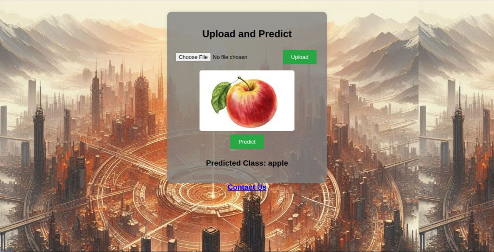

# Flask-API-Based-Image-Classification-with-EfficientNet-on-CIFAR-100

A Flask-based web application that allows users to upload images and classify them using an EfficientNet-B0 model trained on the CIFAR-100 dataset. The web interface provides real-time predictions and displays the class name instead of a numerical label.

## 🚀 Features
✅ Web-based UI for image classification
✅ EfficientNet-B0 model trained on CIFAR-100
✅ Displays class names instead of class numbers
✅ Supports real-time image upload & prediction
✅ Flask-powered backend for easy deployment

## 📸 Screenshots
🏠 Home Page

🔍 Prediction Output

📞 Contact Page

## 📂 Project Structure:

cifar100-image-classification/
│── static/
│   ├── uploads/         # Stores uploaded images
│   ├── bg_two.jpg       # Background image (if used)
│── templates/
│   ├── index.html       # Main UI page
│   ├── contact.html     # Contact page
│── app.py               # Flask backend (handles image upload & classification)
│── efficientnet_cifar100.pth  # Trained model weights
│── requirements.txt      # Dependencies
│── README.md             # Project documentation

## ⚙️ Setup & Installation

### 1️⃣ Clone the Repository

git clone https://github.com/yourusername/cifar100-image-classification.git
cd cifar100-image-classification

### 2️⃣ Create a Virtual Environment

python3 -m venv cv_venv
source cv_venv/bin/activate  # For Linux/Mac
cv_venv\Scripts\activate     # For Windows

### 3️⃣ Install Dependencies
pip install -r requirements.txt

### 4️⃣ Download CIFAR-100 Class Names

Run the following script to download class names:

import torchvision
cifar100_classes = torchvision.datasets.CIFAR100(root="./data", train=True, download=True).classes
print(cifar100_classes)

### 5️⃣ Run the Flask App

python app.py

Open your browser and go to:
➡️ http://127.0.0.1:5000/

## 🔧 Usage
1️⃣ Upload an Image
2️⃣ Click Predict – The model will classify the image
3️⃣ See the Predicted Class Name

## 📦 Dependencies
Flask (for the web application)
PyTorch & torchvision (for EfficientNet-B0)
PIL (Pillow) (for image processing)

## Install them manually:

pip install flask torch torchvision pillow

## 🛠 Customization
Replace efficientnet_cifar100.pth with a custom-trained model.
Modify app.py for additional functionality (e.g., different models, preprocessing changes).
Update index.html to enhance UI/UX.

# 🤝 Contributing
If you'd like to contribute, feel free to fork this repository, make your changes, and submit a pull request.

